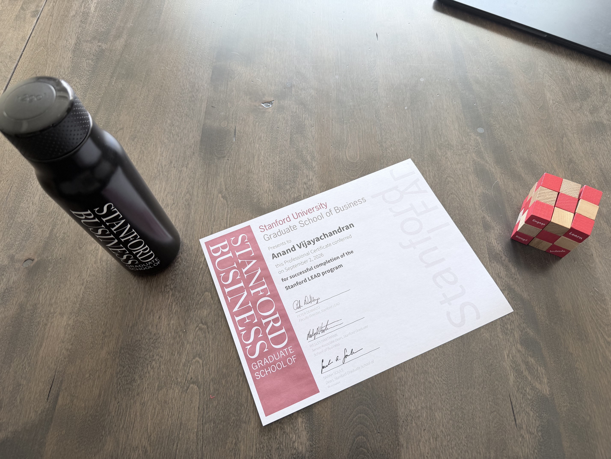
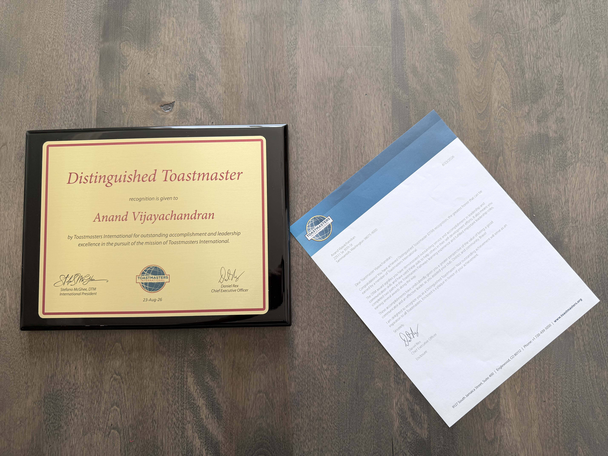


  
  


## A Long Game, And a Sprint

I have spent the last nine years in Toastmasters, and this year I was honored to achieve the Distinguished Toastmasters (DTM) credential. It was a milestone, yes, but it was also a reminder that real growth rarely arrives in a dramatic moment. It accumulates quietly over time through repetition, feedback, humility, and courage.

And if you think that sounds inspiring, let me tell you the truth: it often feels like trying to give a confident speech while your nervous system is running a full-scale hostage negotiation with your own voice.

I spend the last one year at the Stanford Graduate School of Business Learn, Engage, Accelerate, Disrupt (LEAD) online business program. Both journeys asked me to do the same thing: learn consistently, engage seriously, accelerate through action, and disrupt the habits that keep me comfortable. In other words, Toastmasters and LEAD were not separate stories; they were two versions of the same lesson, just in different costumes.

## The Common Thread: Practice Turns Potential into Capability

Toastmasters taught me that communication is not a talent bestowed by the gods. It is a craft. It is learned. It is practiced. It is occasionally painful. It is also a lot more fun than most people think, especially when you have a room full of people who are kind enough to clap even when your opening story is one sentence away from becoming a cautionary tale.

At first, the speeches were awkward. My transitions were clumsy. My stories were too long. My evaluations arrived like polite but precise surgeons: helpful, honest, and impossible to ignore. But over time, something changed.

I became more confident in front of an audience. I learned to structure my ideas more clearly. I became more comfortable with silence, emphasis, and pacing. I discovered that speaking well is not about sounding polished at all costs. It is about being present, listening closely, and helping people understand something they did not understand before.

The LEAD program built on the same foundation, but in a more strategic and executive context. It was not simply about learning frameworks. It was about questioning assumptions, engaging with people from different backgrounds, and turning ideas into action. In that sense, LEAD was not a departure from Toastmasters. It was the next level of the same discipline: communicate clearly, think critically, and lead with purpose.

## Learn: Building the Foundation

In Toastmasters, learning begins with fundamentals: how to structure a speech, how to build a message, how to calm the butterflies, and how to recover when a joke lands with all the grace of a dropped soup spoon. It sounds basic, but those basics are the engine of everything else.

The same was true in LEAD. The curriculum pushed me to understand leadership, strategy, and organizational change in a more rigorous and practical way. It taught me to think more strategically and to connect insight with execution. It was intellectually demanding, but also grounded in the same truth: without a strong foundation, there is no meaningful acceleration.

That is where my technical background became important. My path in technology shaped how I think about systems, automation, and building things that actually work in the real world. It led me to found Phoenix DevOps with a mission to “Deliver DevOps automation and training solutions to customers so that they can focus on what matters.”

That mission captures a lot of what leadership means to me. The goal is not to impress people with complexity. It is to simplify the hard parts, remove friction, and help others do their most important work without getting buried in operational chaos. The same principle applies to public speaking and leadership: clear systems matter, but so does human trust.

## Engage: The Power of Community

One of the greatest gifts of Toastmasters has been the community. I have learned as much from the people in the room as from the speeches themselves. Feedback from peers has shaped me. Watching others speak has sharpened my standards. Serving as an officer and district leader taught me responsibility, coordination, and the difference between managing and leading.

The community element is not extra. It is the mechanism that makes growth sustainable. A person can read books on communication, but the real transformation happens when someone says, “You had a strong opening, but your story needs more clarity,” and you realize they are right before your ego has time to file a complaint.

Over the years, Toastmasters gave me something that is easy to underestimate: long-term connections. The people I met in the club were not just fellow members; they became trusted peers, mentors, collaborators, and friends. Some of those relationships were built slowly over time, through repeated conversations, feedback, and shared commitment to growth. That is the special beauty of Toastmasters. It creates a network that is not flashy, but it is deep. People know your strengths, your growth areas, and your work ethic because they have seen you in the trenches of rehearsals, evaluations, and leadership roles.

That kind of connection is powerful because it compounds. It creates a web of trust that can support you in ways that are practical, emotional, and strategic. It is one of the reasons Toastmasters has always felt less like a club and more like a career-long community of people invested in each other’s growth.

A perfect example of this was the speak-a-thon project I organized at [New Horizons Toastmasters Club](https://www.newhorizonsarizona.org/) in Arizona. I wanted an event that was fun, inclusive, and useful, but if I am being honest, I mostly wanted to create a gathering where people could practice speaking in a low-pressure environment without dramatically checking the exits. The planning was part logistics, part chaos, and part community-building experiment. We partnered with Gilbert Toastmasters and had members from both clubs preparing speeches, recruiting participants, and trying to make the whole thing look more “organized learning experience” and less “a room full of humans with coffee and hope.”

The result was magical. The room was alive with nervous energy and supportive applause. People who were shy at first stepped forward. Others, who had previously only spoken in tiny circles, found their voices in a bigger space. That event captured the essence of Toastmasters: courage, generosity, and the realization that communication is not about being perfect. It is about being present, willing to improve, and brave enough to start.

The same spirit showed up in my work through Lead AI Launchpad, which I started as Chief Editor to curate blogs, publish newsletters, and host podcasts. That business is an extension of the same lesson. Leadership is not just about having ideas; it is about creating platforms where ideas can be shared, refined, and amplified. Through Lead AI Launchpad, I am helping others turn insights into narrative, and narrative into momentum.

And in the same way, the LEAD Architects cohort created a different kind of connection: immediate, purpose-driven, and energizing. It was not a slow-burn network built over years. It was a cohort of people who were already aligned around a common goal, motivated to learn, and ready to help one another succeed. The connections felt fast because they were grounded in shared ambition and mutual respect. It was a reminder that meaningful networks do not always have to be built slowly. Sometimes they emerge quickly when the right people are gathered around the right challenge.

That is the connection between Toastmasters, LEAD, and entrepreneurship: each one is about giving good ideas a voice and a structure. In a world full of noise, communication is still one of the highest-value skills a person can build, and strong communities are what turn good skills into lasting opportunity.

## The Speechcraft Story: Leadership in Practice

One of the most meaningful experiences in my Toastmasters journey was chairing the Speechcraft program as part of an effort to find a counselor for a youth club. That may sound like a niche volunteer effort, but it revealed something essential: communication is not an abstract skill. It is a way of helping people feel seen, confident, and capable.

Speechcraft is designed to help people improve their speaking, confidence, and communication skills. In this case, it was part of a broader effort to support a youth club and identify a counselor. The challenge was not just teaching people how to speak better. It was creating a path where a community could see that confidence and communication are not abstract concepts. They are tools for belonging, trust, and leadership.

This was not just about speeches, it was about helping young people find their voice. The work mattered. The room mattered. The encouragement mattered. And for a club looking for a counselor, one important lesson emerged: the same courage it takes to stand up and speak in front of a room is the same courage it takes to ask for help, to open up, and to become part of something bigger than yourself.

That is the kind of project Toastmasters makes possible. It turns communication into community, and community into confidence. It also makes you realize that leadership is often less about being the loudest person in the room and more about making space for other people to grow.

> “Toastmasters is not just about speaking well. It’s about helping others find their voice, and that is where real leadership begins.”

## Mentors and the Secret Nobody Knows

My mentor once told me, “Toastmasters is the world’s best kept secret.” She was right.

It is the kind of secret that does not show up in headlines or glossy corporate seminars. It is not marketed as a silver bullet for success. It is not glamorous. But it quietly builds leaders, improves confidence, and creates communities where people become better communicators, stronger listeners, and more thoughtful human beings.

And in my case, that secret was one of the biggest enablers of my success in the Stanford GSB LEAD program. By the time I was in LEAD, I had already spent years learning how to prepare, speak, listen, and lead in public. I had already developed the habit of turning uncertainty into organized thought. I had already learned how to stay calm when the room is watching. That background made a remarkable difference.

Stanford LEAD asked for strategic thinking, executive-level perspective, and confident engagement. Toastmasters had already trained me in a foundational skill that no classroom can replace: the ability to present your thoughts clearly and with composure. In that sense, LEAD did not introduce me to leadership; it gave me a bigger stage on which to practice it.

What stood out even more was the kind of network the LEAD Architects cohort created. Unlike the slower accumulation of relationships in Toastmasters, these connections were immediate and high-value. People came in with a shared mission, a common desire to grow, and a readiness to help one another. It felt like the difference between building a long-term community and stepping into a room full of aligned peers who already understood the game and were ready to support each other. That kind of network is incredibly powerful because it transforms learning into momentum.

## Accelerate: From Insight to Action

This is where the story becomes especially clear. Toastmasters taught me how to communicate with confidence. LEAD taught me how to think strategically and lead at scale. My technical work through Phoenix DevOps taught me how to build systems that remove friction. My work through Lead AI Launchpad taught me how to turn insight into narratives, communities, and platforms.

Together, these experiences reinforce the same lesson: the work of leadership is not simply to have ideas. It is to organize them, share them, and turn them into action.

That is why the DTM credential and the Stanford LEAD experience feel so connected to me. Both are markers of sustained effort, reflective practice, and deliberate growth. Neither is just a badge. They are proof that I kept showing up, kept learning, and kept building the skills required to lead well.

## Disrupt: Rewriting Old Habits

Perhaps the most important parallel is the disruption component.

Toastmasters disrupted my comfort with hesitation. It challenged my tendency to overthink, to speak too quickly, or to let fear dictate my pace. It taught me to stop treating communication as performance and instead treat it as service: helping people understand, think, and feel something meaningful.

LEAD disrupted my approach to leadership in a broader way. It pushed me to think beyond my immediate context and consider how strategy, systems, and execution work together. My entrepreneurial work through Phoenix DevOps and Lead AI Launchpad continues that disruption by testing the idea that leadership is not a title; it is a set of habits that create clarity, trust, and momentum.

The shared lesson is simple: real growth does not happen inside comfort. It happens when we are willing to be stretched.

## Why the Two Milestones Feel So Connected

The reason the DTM credential and the Stanford LEAD program feel so closely connected is that they reflect a larger personal philosophy: leadership is built, not bestowed.

Toastmasters taught me to speak with confidence and conviction. It gave me long-term relationships and a network of people who know my voice, my growth, and my work. LEAD taught me to lead with context and strategy, and the LEAD Architects cohort gave me a different kind of connection: immediate alignment, quick trust, and peer support built around a shared purpose. Taken together, they reveal the same truth: the highest-value leadership skills are not abstract concepts. They are practiced habits, backed by relationships that help you keep growing.

In Toastmasters, I learned to make a room lean in.
In LEAD, I learned to think in systems and scale ideas into action.
In Phoenix DevOps, I learned to remove operational friction so people can do meaningful work.
In Lead AI Launchpad, I learned to help ideas travel beyond a single room and become a public conversation.

That is the arc of my journey: from speaking well to thinking clearly to building systems that serve people.

## A Final Reflection

In LEAD they call it reflection and in toastmasters they call it constructive feedback. One cannot improve without reflections and feedback. 

Toastmasters gave me the discipline of communication. LEAD gave me the discipline of strategic leadership. Phoenix DevOps gave me the discipline of building practical resilient systems. Lead AI Launchpad gave me the discipline of shaping conversations and telling stories that matter. Together, they taught me that a strong leader is not someone who simply has ideas or speaks eloquently. A strong leader is someone who learns consistently, listens carefully, acts courageously, and keeps refining their craft.

That is why these milestones matter to me. They are not just about achievement. They are about identity and my purpose.

And if there is one thing Toastmasters has taught me, it is this: even when the speech is a little rough, even when the project is messy, and even when the room is full of nerves, I can rest assured that I am in a supportive learning environment that helps me improve my communication and leadership skills.

That lesson carried me through Toastmasters, through the speak-a-thon in Arizona, through the Speechcraft effort, through LEAD, and into the work I now do through Phoenix DevOps and Lead AI Launchpad.

It is both a long game and a sprint. They have both been good ones.

---

*In both Toastmasters and Stanford LEAD, the work was never about perfection. It was about progress. And in the end, that is how leadership becomes a craft, a calling, and a life built on useful action.*
