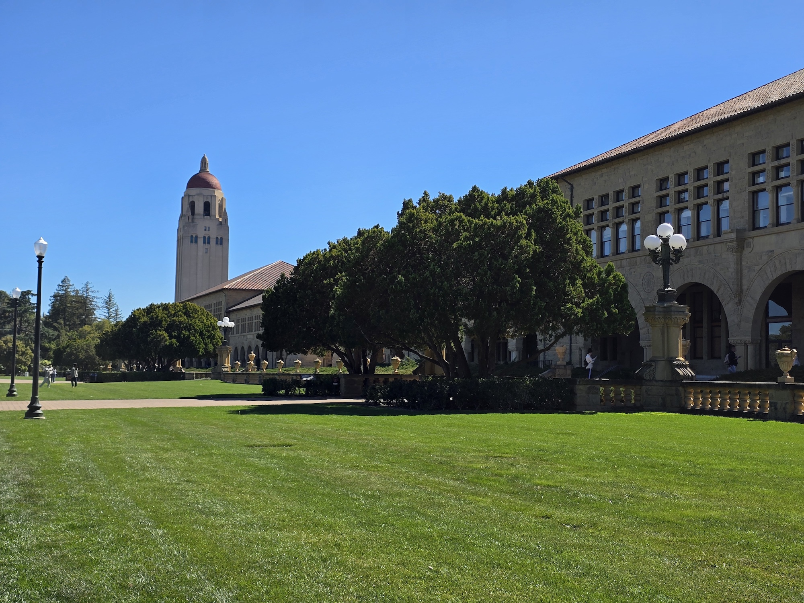
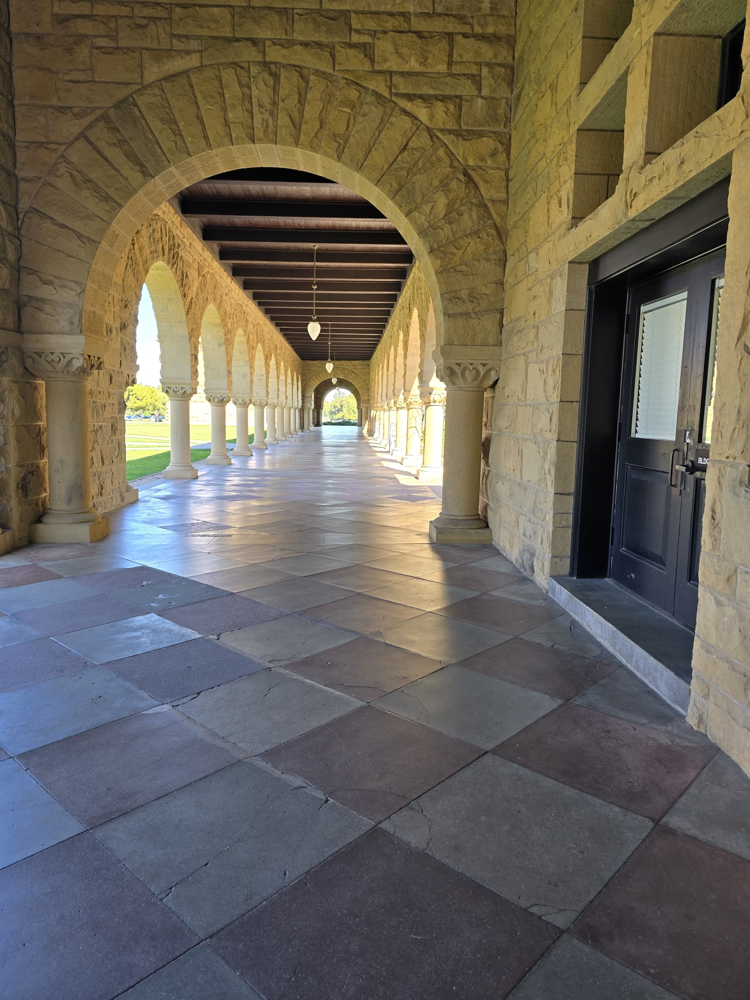
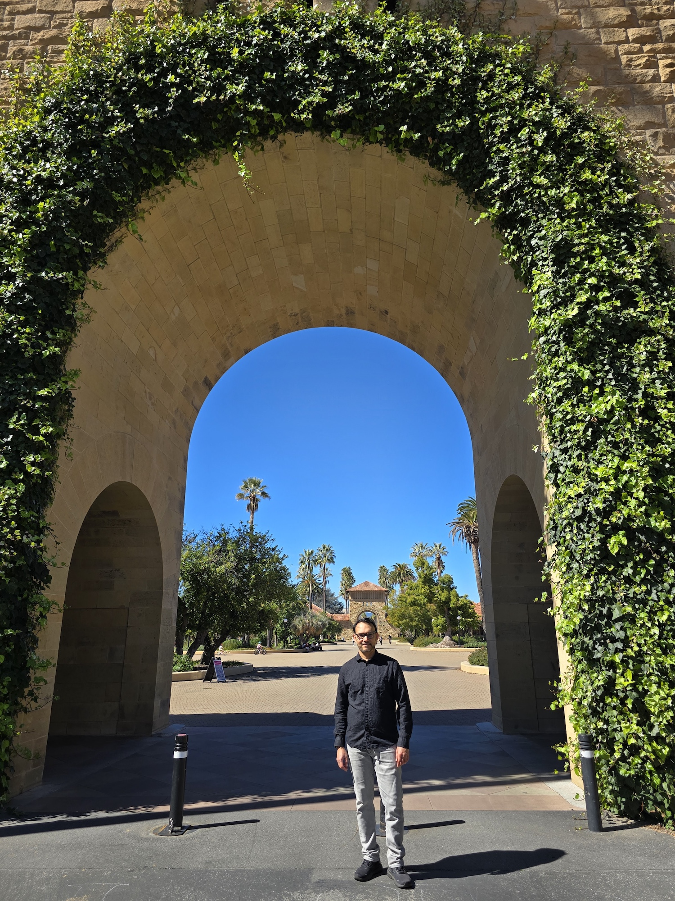
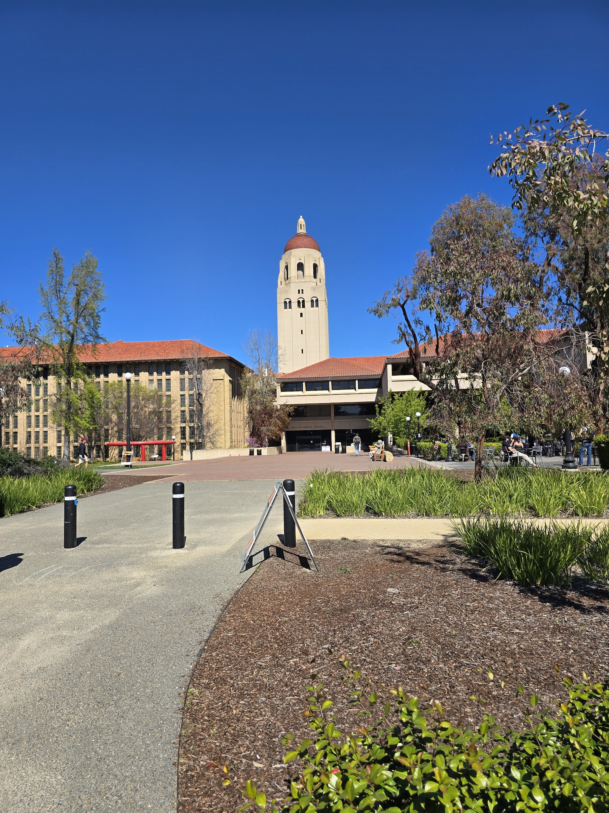
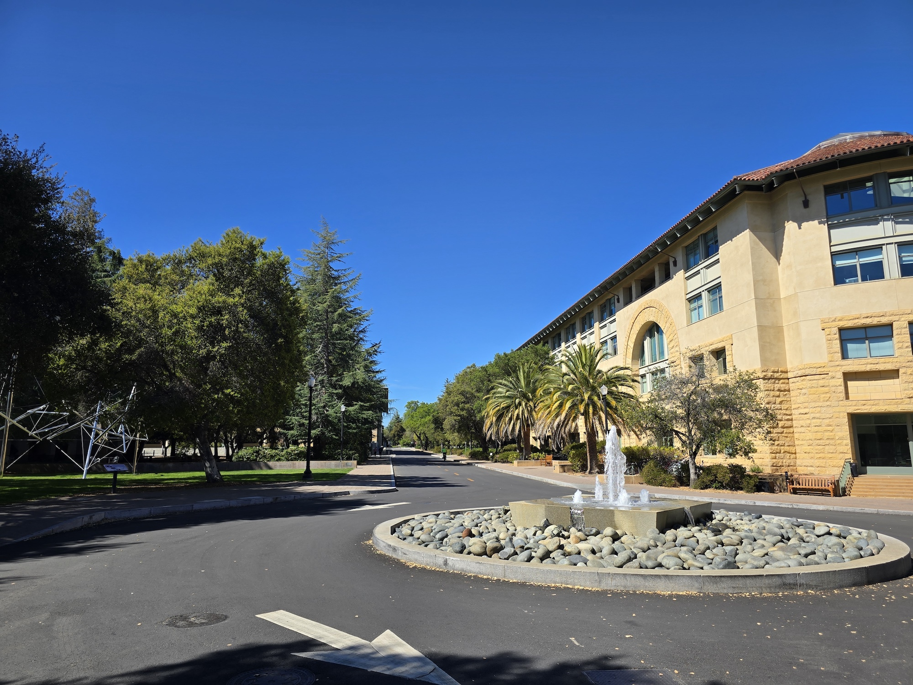


  
  
  
  
  
  


# A Nostalgic Stroll Through Stanford

My visit to **Stanford Campus** brought me straight back to my school days—but with fewer pop quizzes and, thankfully, no math homework. I absolutely love pretending to be a student again *(if only my knees agreed).*  

The scene outside the campus diner, with a sea of parked bicycles and the constant student chatter, reminded me of those legendary college nights: studying until midnight, then hunting for snacks as though our very survival depended on finding a bag of chips.  

Standing in the quad was almost surreal—arched hallways stretching around me and the impressive church at the center. It felt like stepping inside a postcard, just one with better Wi-Fi.

---

## First Impressions: Energy Everywhere

From the moment I set foot on campus, I was dazzled by its beauty and the burst of energy in the air.

- **Palm-lined walkways** with a few students lurking around on Sunday  
- Some clearly perfecting their *Tour de Stanford* cycling skills  
- Groups chatting animatedly at the **campus dining**  
- Lawns filled with students attempting to study but mostly **soaking up the California sun**

More than a few textbooks seemed suspiciously unused, serving primarily as props beneath stylish sunglasses.

---

## Wandering the Main Quad

As I wandered through the grand archways near the **Main Quad**, I could not help but admire the classic **Spanish-style architecture** and warm sandstone buildings.

It is the kind of place where you half-expect to bump into:

- A brilliant professor deep in thought  
- A startup founder sketching ideas on a napkin  
- Or a slightly confused tourist wondering where the gift shop is

The elegant archways and quiet courtyards create an atmosphere that feels both historic and alive.

---

## The Heart of the Campus

The area around **Memorial Church** was especially lively.

- Colorful **mosaics shimmered in the sunlight**
- A sense of **peaceful calm** surrounded the central courtyard
- Students and visitors passed through, conversations echoing beneath the arches

Right in the center of the quad, the church seems to hold everything together, a symbol of history and tradition quietly observing the latest campus trends.

Which, on this particular afternoon, included:

- Electric scooters  
- Students racing across the quad  
- And one individual **juggling oranges with impressive commitment**

---

## A Stop at the Campus Diner

Eventually the scent of fresh coffee led me into the **campus diner**.

Inside, the afternoon snack bar felt wonderfully familiar—just like my old college haunts where study breaks somehow always turned into story telling routines.

The atmosphere was:

- Warm  
- Noisy  
- Full of students on serious snack missions

Before long, I found myself swapping stories and laughter with a group of students who were genuinely fascinated by tales of life **before smartphones**.

Their reactions included:

> Audible gasps and mild disbelief.

Apparently surviving college without instant messaging now qualifies as an extreme sport.

---

## Final Reflections

My time at Stanford turned out to be more than a nostalgic campus stroll.

It reminded me of something easy to forget with time:

- The **joy of curiosity**
- The **energy of young minds**
- The friendships and spontaneous moments that make student life unforgettable

Campuses like Stanford capture a special spirit—one where inspiration, laughter, and just a little chaos float constantly through the air.

And for a few hours, walking those palm-lined paths, I got to be a student again.