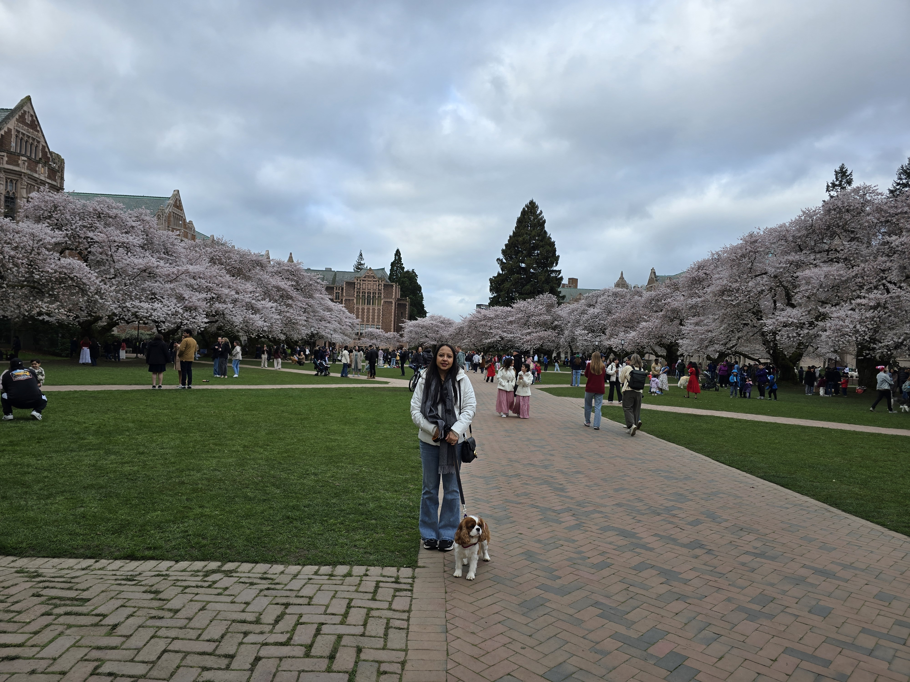


  
  
  
  


## A Moment in Time

There's something transcendent about standing beneath a canopy of cherry blossoms. The delicate pink and white petals float down like snow, catching the spring sunlight as they drift past. This past spring, I made my yearly pilgrimage to the University of Washington's campus with my wife Nisha and our dog Ziggy to witness this fleeting natural spectacle, a tradition that returns for only a brief window each year.

Though I should clarify: Nisha came for the blossoms. Ziggy came for the grass.

## The Cherry Blossom Season

The Japanese cherry blossoms at UW are a marvel of botanical timing. For just a few weeks each spring, usually in late March through early April, the campus undergoes a magical transformation. The trees, a gift representing the enduring friendship between Japan and the United States, burst into bloom in a synchronized celebration that has become a cherished Seattle tradition.

The exact timing is unpredictable. Too cold a spring delays the blossoms; too warm, and they appear and fade in mere days. This unpredictability adds to their allure. There's an understanding among visitors that you must seize the moment when the blooms appear, because it won't last long.

## Wandering the Campus

Walking through the UW campus during peak bloom is like stepping into another world. The Quad, typically bustling with students hurrying between classes, becomes a place of quiet contemplation. Clusters of cherry trees line the pathways, creating natural tunnels of pink and white flowers. 

The afternoon we visited, the trees were at their absolute peak. The petals were thick on the branches, releasing them continuously in gentle cascades. Paths of fallen blossoms created patterns on the ground, nature's artwork renewed with each gust of wind. Ziggy, meanwhile, was trying to eat the fallen petals, convinced they were some new type of delicacy we'd been hoarding from him.

Nisha walked ahead, completely entranced by the beauty, snapping photos from every conceivable angle. I'd suggest a different spot, she'd find three better ones. "Look at the way the  those branches are blanketing the historic buildings like the library," she'd say, while I'd already moved on to the next aesthetically pleasing area. When it comes to photography, she has the eye; I have the legs.

I found myself slowing down, something that happens rarely in ordinary life. The urge to check my phone faded, mostly because Nisha had already checked it for me and deemed there was nothing worth seeing. Conversations shifted naturally to whispers, though Ziggy occasionally broke the peaceful silence with enthusiastic barking at particularly photogenic clusters of blossoms. The cherry blossoms seem to demand reverence, even if our king charles cpaniel didn't get the memo.

## Why Cherry Blossoms Matter

In Japanese culture, cherry blossoms represent the transience of life, the beauty is heightened by its impermanence. Known as *sakura*, these blossoms have symbolized renewal and the fleeting nature of existence for centuries. To witness them is to contemplate the ephemeral moments that make life meaningful.

Standing beneath those blossoms with Nisha holding my hand and Ziggy's leash, I understood this sentiment deeply. We spend so much time planning for the future, managing the past, that we miss the present moment. The cherry blossoms don't wait. They bloom, they shine, and then they're gone—leaving only memories and fallen petals behind (and whatever Ziggy managed to track home in his fur).

There's also something poignant about experiencing these fleeting moments with the people, and dogs, you love. In a few years, Ziggy will be gray, muzzled and slow, Nisha and I will be a few years older, and these cherry blossoms will have bloomed and faded countless times. But this moment? Right here, under the swirling pink petals, with my wife laughing at our dog's antics? This moment is eternal.

## A Spring Tradition Worth Keeping

If you've never witnessed the cherry blossoms at UW, I strongly recommend making the journey. Plan ahead for late March or early April, follow the Seattle bloom forecasts, and set aside an afternoon to wander the campus without agenda or destination.

Bring a camera if you wish, honestly, if your spouse is anything like Nisha, you won't have a choice, but consider leaving it behind for at least part of the visit. The most beautiful moments are often the ones we simply experience, rather than capture. (Though do bring a dog if you can. Watching someonel else's golden retriever mix chase falling petals is peak joy.)

The University of Washington's cherry blossoms are a reminder that some of life's greatest pleasures are those we share with nature, fleeting, beautiful, and worth the effort to witness. Even better when shared with the people you love and the occasional befuddled dog who thinks petals are premium snacks.

---

*Have you experienced the cherry blossoms at UW? What was your favorite spot on campus to view them? I'd love to hear about your spring traditions.*
